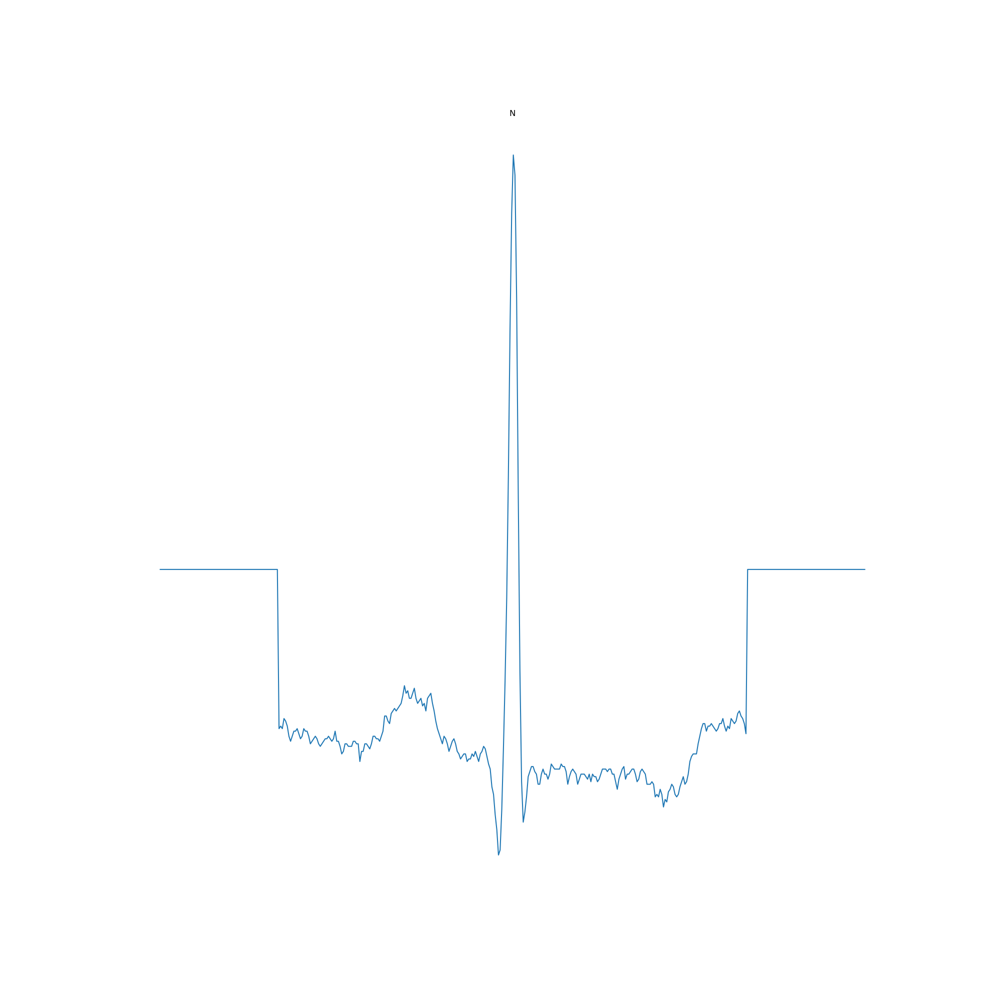
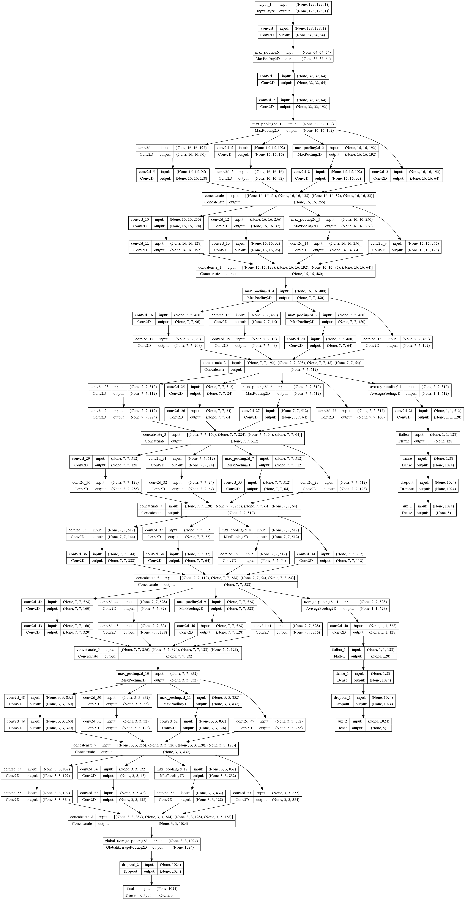
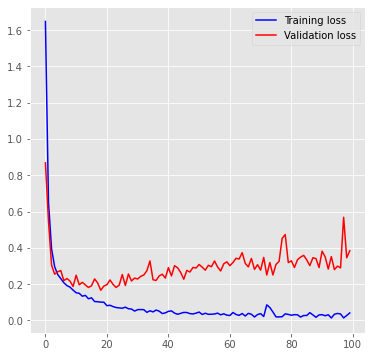
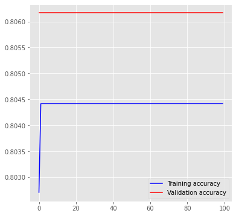
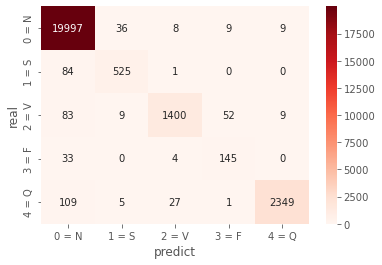
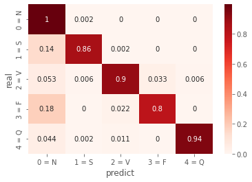
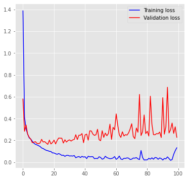
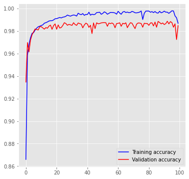
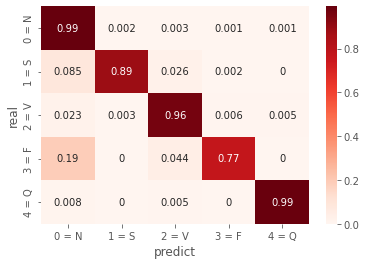

<div style="text-align: center">

# Korea (한국어)

</div>

# Arrhythmia detection based on ECG Signal by Image using 2D Deep CNN

- 2D Image 참고 논문 : [A Hybrid Deep CNN Model for Abnormal Arrhythmia Detection Based on Cardiac ECG Signal](https://www.mdpi.com/1424-8220/21/3/951)

ECG 데이터를 그래프로 변환하여 2D CNN에 심전도를 구별하는 모델이다. 해당 모델은 위 논문에서 2D CNN 의 모델 구조를 참고하였다. 논문에서 입력되는 데이터와 실제 데이터가 차이가 존재하여 이를 명확히 따라하지는 않는다. 어디까지나 __참고__ 일 뿐. 

# Data

그래프로 변환한 이미지 데이터가 2GB가 넘어 LFS을 통해서도 업로드가 어렵다. 코드와 원본 데이터를 올려두었으니 *cutting_graph.py* 파일을 사용하면 파일을 구할 수 있다. 그 과정이 너무 오래걸린다 싶으면 아래 링크를 통해서 다운로드를 받을 수 있다.
- [Graph Input data - Google drive Link](https://drive.google.com/file/d/1DjuzXjQ21p3Bhuky8ojlvzzRiAnffzvP/view?usp=sharing)

Input data의 예시를 하나 보여주면 아래와 같은 이미지가 들어가게 된다.


이미지 크기가 좀 크긴하다만 어차피 모델에 들어가기 이전에 조정을 하고 들어간다. 256 * 256 사이즈로 입력값으로 들어가게 된다. 기존에는 plot title 을 실수로 추가를 해버려서 불필요한 데이터가 들어갔다만 그 부분도 수정하여 이제는 그래프만 저장 되도록 수정하였다. 위 사진은 Normal 비트 예시 일 뿐, 모든 비트가 저리 이쁘진 않다... ~~사실 노이즈도 있어서 그렇게 이쁘다고는 못하지만 그래도 곱게 봐달라.~~ 

## Model 구성


차이가 있다면 끝단에서 출력하는 나오는 Class의 개수가 다르다. 우리는 5개 (N, S, V, F, Q) 를 갖고 했으나 해당 논문에서는 8개로 분류를 진행하였다. 거의 사실상 CNN과 Maxpool layer를 통과하여 특징을 뽑아내는데 고급지고 똑똑한 야바위라고 해도 되지 않을까 싶다. Grayscale로 들어가게 되니 결과적으로는 모델이 보는건 이미지의 특징이다.

# Result

## Confusion Matrix


데이터의 비중에 따라 다른 결과 값으로 예상된다. S, F 클래스가 다른 클래스에 비해 확연히 비중이 적다보니 잘 잡아내지 못하는 것으로 생각된다. Summary Report 는 아래와 같다.

```
              precision    recall  f1-score   support

       0 = N       0.99      0.99      0.99     20059
       1 = S       0.94      0.86      0.90       610
       2 = V       0.95      0.96      0.95      1553
       3 = F       0.88      0.80      0.84       182
       4 = Q       0.98      0.98      0.98      2491

    accuracy                           0.99     24895
   macro avg       0.95      0.92      0.93     24895
weighted avg       0.99      0.99      0.99     24895
```

---

# GoogLeNet (Inception)

Inception 을 활용한 GoogLeNet 을 구성하여 2D CNN 모델로 구성하였다. 모델의 Shape 및 크기는 아래와 같이 구성되어 있다.

꽤나 복잡한데 간단히 GoogLeNet과 Inception을 설명을 하고 가면 Inception은 현재 까지 v3 까지 나온 모델이다. 블록 모델처럼 쓰이는데 Inception을 활용한 모델이 GoogLeNet 이다. GoogLeNet != Inception 이니 헷갈리지 않길 바란다.

Inception은 아래와 같이 구성되어 있다.


보이는 바와 같이 Convolution Layer와 MaxPooling Layer의 연속이다. 이를 여러번 합치고 합친 모델이 GoogLeNet 인거고. 영화 Inception 처럼 깊이 들어가고 들어가게 되는데 MaxPooling은 Convolution Layer의 연산량을 줄이기 위함이다. 워낙에 너무 연산량이 많아지면 시간이 너무 오래 걸리게 되면서 이를 줄이기 위한 방법이다.

## Result

- Train and Validation Accuracy, Loss




- Confusion Matrix




```
             precision    recall  f1-score   support

       0 = N       0.98      1.00      0.99     20059
       1 = S       0.91      0.86      0.89       610
       2 = V       0.97      0.90      0.94      1553
       3 = F       0.70      0.80      0.75       182
       4 = Q       0.99      0.94      0.97      2491

    accuracy                           0.98     24895
   macro avg       0.91      0.90      0.90     24895
weighted avg       0.98      0.98      0.98     24895
```

## Result

해당 결과값은 스펙토그램을 입력으로 한 결과 값이다. 기존에는 Raw 그래프 이미지를 넣었던 모델에 스펙토그램으로 변경하였다. GrayScale이 아닌 RGB 그대로 들어간다.

- Train and Validation Accuracy, Loss




- Confusion Matrix




```
            precision    recall  f1-score   support

       0 = N       0.99      0.99      0.99     20059
       1 = S       0.92      0.89      0.90       610
       2 = V       0.94      0.96      0.95      1553
       3 = F       0.86      0.77      0.81       182
       4 = Q       0.99      0.99      0.99      2491

    accuracy                           0.99     24895
   macro avg       0.94      0.92      0.93     24895
weighted avg       0.99      0.99      0.99     24895
```

<div style="text-align: center">

# English (영어)

</div>

# Arrhythmia detection based on ECG Signal by Image using 2D Deep CNN

- 2D Image reference paper : [A Hybrid Deep CNN Model for Abnormal Arrhythmia Detection Based on Cardiac ECG Signal](https://www.mdpi.com/1424-8220/21/3/951)

It is a model that converts electrocardiogram data into graph images and distinguishes electrocardiograms in 2D CNN. The model referenced the model structure of 2D CNN in the paper above. There is a difference between the data entered in the thesis and the actual data, so it is not clearly observed. The thesis is for __reference__.


# Data

The image data converted into a graph exceeds 2 GB, so uploading it through LFS is also difficult. Now that you've uploaded your code and raw data, you can use the *cutting_graph.py* file to save the file. If the process is taking too long, you can download it via the link below.

- [Graph Input data - Google drive Link](https://drive.google.com/file/d/1DjuzXjQ21p3Bhuky8ojlvzzRiAnffzvP/view?usp=sharing)

If you show an example of the input data, the image below is input.


The image size is a bit large, but anyway I make adjustments before going into the model. It is entered as an input value of size 256 * 256. In the past, there were unnecessary parts because the plot title was added by mistake, but that part was also corrected and now only the graph is saved. The photo above is just an example of a plain beat. Not all beats look so good...

## Model 구성


If there is a difference, the number of classes output at the end is different. There were 5 (N, S, V, F, Q), but in this paper, they were classified as 8. Almost in fact, it is a progressive and smart gambler in extracting features through CNN and Maxpool layers. When grayscaled, what the resulting model sees is a characteristic of the image.

# Result

## Confusion Matrix


Different results are expected depending on the weight of the data. Class S and Class F seem to not be able to capture well because they weigh significantly less than the other classes. Here's the summary report:
```
              precision    recall  f1-score   support

       0 = N       0.99      0.99      0.99     20059
       1 = S       0.94      0.86      0.90       610
       2 = V       0.95      0.96      0.95      1553
       3 = F       0.88      0.80      0.84       182
       4 = Q       0.98      0.98      0.98      2491

    accuracy                           0.99     24895
   macro avg       0.95      0.92      0.93     24895
weighted avg       0.99      0.99      0.99     24895
```

---

# GoogLeNet (Inception)

GoogleLeNet using Inception was constructed to form a 2D CNN model. The shape and size of the model consists of:


It's quite complicated, but if you briefly explain GoogLeNet and Inception, Inception is a model that has been released up to v3 so far. It is used like a block model, and the model using Inception is GoogLeNet. GoogLeNet != Inception so don't get confused.

Inception consists of the following:


As you can see, it is a continuation of the convolutional layer and the MaxPooling layer. A model that has been merged multiple times is called GoogleLeNet. It goes deep like the movie Inception. MaxPooling is to reduce the computational amount of the Convolution Layer. This is a way to reduce the amount of computation because it takes too long when the amount of computation is too much.

## Result

- Train and Validation Accuracy, Loss


- Confusion Matrix


```
             precision    recall  f1-score   support

       0 = N       0.98      1.00      0.99     20059
       1 = S       0.91      0.86      0.89       610
       2 = V       0.97      0.90      0.94      1553
       3 = F       0.70      0.80      0.75       182
       4 = Q       0.99      0.94      0.97      2491

    accuracy                           0.98     24895
   macro avg       0.91      0.90      0.90     24895
weighted avg       0.98      0.98      0.98     24895
```

## Result

The resulting value is the resulting value of the spectogram as input. In the past, a model with a raw graph image inserted was changed to a spectogram. Enter RGB as is, not GrayScale.

- Train and Validation Accuracy, Loss


- Confusion Matrix


```
            precision    recall  f1-score   support

       0 = N       0.99      0.99      0.99     20059
       1 = S       0.92      0.89      0.90       610
       2 = V       0.94      0.96      0.95      1553
       3 = F       0.86      0.77      0.81       182
       4 = Q       0.99      0.99      0.99      2491

    accuracy                           0.99     24895
   macro avg       0.94      0.92      0.93     24895
weighted avg       0.99      0.99      0.99     24895
```
